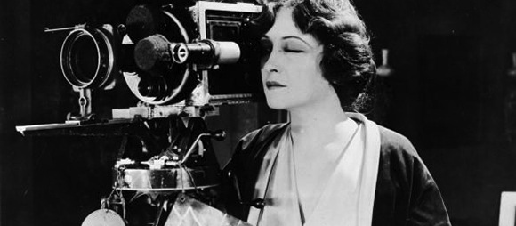

# Badass Chicks in Film

This is an open source iOS App for Women Who Code.

Admittedly messy and hacked together in a couple of weekends, open for collaboration with others.

Since the back end is Parse, we can use the REST API for Android, web (Ruby, Javascript, etc) projects. Just ask me for the Secret Keys.

# Features

* Learn about women film directors, favorite them
* Follow women film directors' current films
* Find films that pass the Bechdel test

# Architecture

* iOS App for now
* Backend is Parse - can be used for Android, web (Ruby, Javascript) so just ask Romy for the secret keys

# Todo

* Add friends feature so people can be friends with each other and suggest female directors to each other /see their friends' favorite directors
* Add bechdel test for film (it's already in the database)
* Add easy login from facebook/twitter etc
* Add social sharing so users can promote their favorite female film directors
* Add feedburner from Indiewire (women in hollywood) and other cool outlets
* Redo the photographs since we don't have copyright - or find official versions - can probalby paint them :) 
* Eventually create a web version that people can update
* Add video clips to back end so that we can link to youtube, etc.

